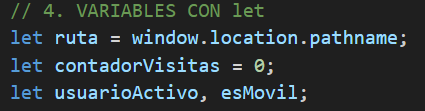
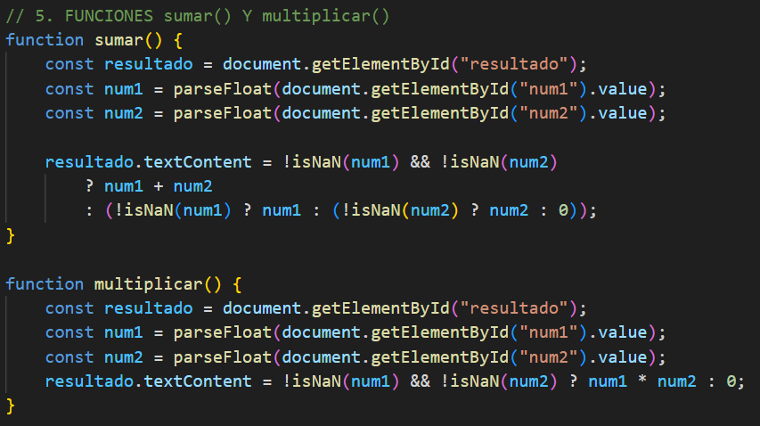
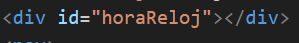

# u4-js-sitio
Nelson Enrrique Conde Tarazona - 1152391

2. Crear carpeta /js y archivo app.js enlazado en todas las páginas.

    
    

3. Declarar constantes APP_NOMBRE, APP_VERSION, ANIO

    

4. Variables con let: contadorVisitas, usuarioActivo, esMovil.

    

5. Funciones sumar() y multiplicar().

    
    
    

6. Mostrar mensaje de bienvenida en #salida con template string.

    
    
    

7. Botón con contador de visitas y actualización en #totalVisitas.

    
    
    
    

8. Función mostrarHora() con reloj en header.

    
    
    La hora se actualiza cada segundo
    
    

9. Navegación activa usando data-page y clase activo.

    
    
    

10. DOM básico: cambio de color con botones (rojo, verde, azul).

11. DOM avanzado: lista de notas con validación de input.

12. Validación de formulario en contacto.html con mensajes de error.

13. Mensaje de éxito al enviar formulario válido.

14. Buscador en servicios.html con coincidencias en tiempo real.

15. Función evaluarNumero(n) con if/else.

16. Función obtenerDia(numero) con switch.

17. Renderizar perfil en acerca.html usando template string.

18. LocalStorage para visitas.

19. Clase Util con método formatearMoneda().